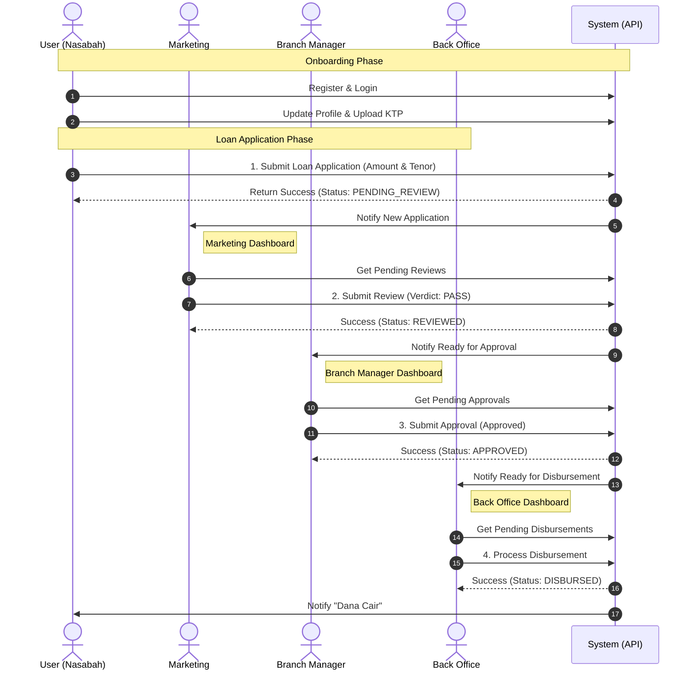

# Business Flow & Logic Documentation

Dokumen ini menjelaskan alur bisnis, logika sistem, dan peran aktor dalam **Loan Management System** (Project Binar).

---

## 1. Aktor & Peran (User Roles)

Sistem ini menggunakan Role-Based Access Control (RBAC) dengan aktor-aktor berikut:

| Peran | Kode Role | Tanggung Jawab Utama |
|---|---|---|
| **Nasabah** | `USER` | Mendaftar, melengkapi profil (KYC), melakukan simulasi, dan mengajukan pinjaman. |
| **Marketing** | `MARKETING` | Melakukan verifikasi awal data nasabah (**Review**). |
| **Branch Manager** | `BRANCH_MANAGER` | Pengambil keputusan kredit (**Approval**). Berhak menyetujui atau menolak pinjaman yang sudah di-review. |
| **Back Office** | `BACK_OFFICE` | Pelaksana pencairan dana (**Disbursement**) untuk pinjaman yang disetujui. |
| **Super Admin** | `SUPER_ADMIN` | Konfigurasi sistem: manajemen user, role, permission, dan produk pinjaman (Plafond). |

---

## 2. Logika Produk (Dynamic Plafond)

Sistem menggunakan logika **Dynamic Product Detection**. Nasabah tidak memilih produk secara manual ("Bronze", "Gold", dll), melainkan produk ditentukan otomatis oleh sistem berdasarkan **Nominal Pengajuan**.

### Logika Deteksi:
1.  User memasukkan jumlah pinjaman yang diinginkan (contoh: Rp 15,000,000).
2.  Sistem mengecek database `Plafond` (Produk) untuk mencari range yang sesuai.
3.  Jika ditemukan (misal: Range 10jt - 50jt = "Product Gold"), maka bunga dan tenor maksimal akan mengikuti aturan produk tersebut.
4.  Jika tidak ada produk yang cover range tersebut, pengajuan tidak bisa dilanjutkan.

---

## 3. Alur Bisnis: Customer Onboarding (KYC)

Sebelum bisa mengajukan pinjaman, user baru wajib melengkapi identitas.

1.  **Registrasi**: User mendaftar akun (`POST /api/auth/register`).
2.  **Login**: User masuk ke sistem (`POST /api/auth/login`).
3.  **Update Profil (KYC)**:
    *   User mengisi data diri lengkap (Nama, NIK, Tgl Lahir, Alamat, Pekerjaan).
    *   User mengupload foto KTP.
    *   API: `PUT /api/profile`.
4.  **Verifikasi Sistem**: Sistem mengecek kelengkapan data (`GET /api/profile/status`). Hanya jika status valid (`true`), user tombol ajukan pinjaman terbuka.

---

## 4. Alur Bisnis: Siklus Pinjaman (Loan Lifecycle)

Ini adalah alur utama dari aplikasi (The Happy Path).

### Tahap 1: Pengajuan (User)
1.  **Simulasi**: User mencoba simulasi (`POST /api/loans/simulate`). Sistem menghitung estimasi cicilan.
2.  **Submit**: User mengajukan pinjaman (`POST /api/loans`).
    *   Input: Nominal & Tenor.
    *   Sistem melakukan validasi limit produk.
    *   **Status Awal**: `PENDING_REVIEW`.

### Tahap 2: Review (Marketing)
1.  **Monitoring**: Marketing melihat daftar pengajuan baru (`GET /api/reviews/pending`).
2.  **Verifikasi**: Marketing mengecek kelengkapan dokumen dan validitas data nasabah.
3.  **Keputusan**:
    *   Jika Oke: Submit Review (`POST /api/reviews/{id}`).
    *   **Status Baru**: `REVIEWED` (Lanjut ke Manager) atau `REJECTED` (Ditolak).

### Tahap 3: Approval (Branch Manager)
1.  **Monitoring**: Branch Manager melihat daftar pinjaman yang sudah di-review (`GET /api/approvals/pending`).
2.  **Analisis**: BM melihat profil risiko, skor kredit (jika ada), dan history.
3.  **Keputusan**:
    *   Jika Oke: Submit Approval (`POST /api/approvals/{id}`).
    *   **Status Baru**: `APPROVED` (Siap Cair) atau `REJECTED` (Ditolak).

### Tahap 4: Pencairan / Disbursement (Back Office)
1.  **Monitoring**: Back Office melihat daftar pinjaman yang disetujui (`GET /api/disbursements/pending`).
2.  **Transfer**: Back Office memproses transfer dana ke rekening nasabah.
3.  **Eksekusi**: Submit Disbursement (`POST /api/disbursements/{id}`).
    *   **Status Akhir**: `DISBURSED`.
    *   User menerima notifikasi dana cair.

---

## 5. Visualisasi Alur (Mermaid)

## 6. Business Rules & Validations

1.  **Soft Delete User**: User tidak pernah dihapus permanen dari database reguler (`deleted = true`), untuk menjaga history audit.
2.  **Validasi Produk**: Range nominal produk tidak boleh tumpang tindih (Overlapping) saat dibuat oleh Super Admin.
3.  **Immutable Loan**: Setelah status berubah menjadi `DISBURSED` atau `REJECTED`, data aplikasi pinjaman tidak bisa diubah lagi.
4.  **Notification Trigger**: Setiap perubahan status (Review -> Approve -> Disburse) akan memicu notifikasi ke User.
